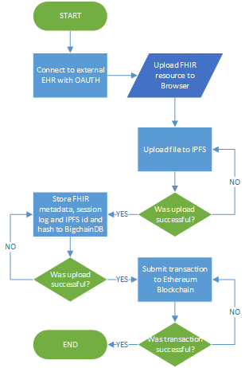

The F.E.B.I Stack
==================

## Introduction

F.E.B.I. stands for 
- FHIR Frontend
- Ethereum
- IPFS
- BigchainDB

F.E.B.I. is a PoC application stack which uses decentralized technologies for Health Records

## Decetralized stack vs Traditional web stacks

FEBI vs LEMP

| Technology        | FEBI         | LEMP   |
| ----------------- | ------------ | ------ |
| Application Logic | Ethereum     | PHP    |
| Database          | BigchainDB   | MySQL  |
| Filesystem        | IPFS         | Linux  |
| Server            | Browser only | Nginx  |

## Frontend

To build the frontend you must have Yarn or npm installed, then run `yarn start` for a local server or `yarn build` to build the files to later upload in IPFS.

## Blockchain TODO

### Requirements

1. Metamask browser plugin
2. Ganache locally installed
3. Truffle locally installed

### Running the smart contracts
- Compile contracts: `truffle compile`
- Migrate contracts: `truffle migrate`
- Test contracts:    `truffle test`

## IPFS

### Requirements

- IPFS Installed https://docs.ipfs.io/introduction/install/

### Instructions

1. In a terminal run `ipfs daemon`
2. In a second terminal run `ipfs add -r ipfs/app`

## TODOs

1. Encrypt FHIR files before upload them in IPFS
2. Ethereum User Registry smart contract
3. Ethereum Asset hashes and signatures smart contract
4. Ethereum Permissioning and Access Control rules smart contract
5. OAuth login to EHR apps with FHIR support (e.g. Epic, Cerner sandboxes)
6. React material UI

